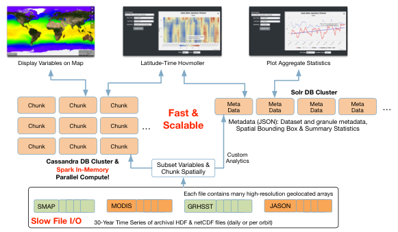

.. _intro:

*******************
About NEXUS
*******************

NEXUS is a data-intensive analysis solution using a new approach for handling science data to enable large-scale data analysis.

It supports a number of algorithms out of the box:

* Time Series
* Latitude/Time Hovmöller
* Longitude/Time Hovmöller
* Latitude/Longitude Time Average
* Area Averaged Time Series
* Time Averaged Map
* Climatological Map
* Correlation Map
* Daily Difference Average

Check out the :ref:`quickstart`.
