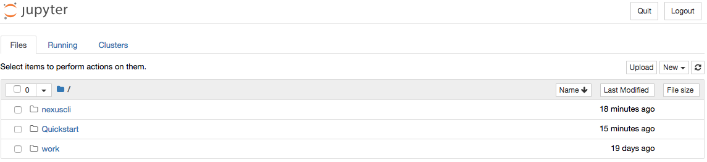
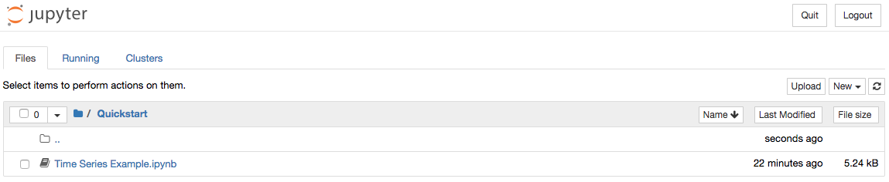

.. _quickstart:

*****************
Quickstart Guide
*****************

This quickstart will take approximately 45 minutes to complete.

Introduction
=============

NEXUS is a collection of software that enables the analysis of scientific data. In order to achieve fast analysis, NEXUS takes the approach of breaking apart, or "tiling", the original data into smaller tiles for storage. Metadata about each tile is stored in a fast searchable index with a pointer to the original data array. When an analysis is requested, the necessary tiles are looked up in the index and then the data for only those tiles is loaded for processing.

This quickstart guide will walk you through how to install and run NEXUS on your laptop. By the end of this quickstart, you should be able to run a time series analysis for one month of sea surface temperature data and plot the result.

.. _quickstart-prerequisites:

Prerequisites
==============

* Docker (tested on v18.03.1-ce)
* Internet Connection
* bash
* cURL
* 500 MB of disk space

Prepare
========

Start downloading the Docker images and data files.

.. _quickstart-step1:

Pull Docker Images
-------------------

Pull the necessary Docker images from the `SDAP repository <https://hub.docker.com/u/sdap>`_ on Docker Hub. Please check the repository for the latest version tag.

.. code-block:: bash

  export VERSION=1.0.0-rc1

.. code-block:: bash

  docker pull sdap/ningester:${VERSION}
  docker pull sdap/solr-singlenode:${VERSION}
  docker pull sdap/cassandra:${VERSION}
  docker pull sdap/nexus-webapp:standalone.${VERSION}

.. _quickstart-step2:

Create a new Docker Bridge Network
------------------------------------

This quickstart constsists of launching several Docker containers that need to communicate with one another. To facilitate this communication, we want to be able to reference containers via hostname instead of IP address. The default bridge network used by Docker only supports this by using the ``--link`` option wich is now considered to be `deprecated <https://docs.docker.com/network/links/>`_.

The currently recommended way to acheive what we want is to use a `user defined bridge network <https://docs.docker.com/network/bridge/##differences-between-user-defined-bridges-and-the-default-bridge>`_ and launch all of the containers into that network.

The network we will be using for this quickstart will be called ``sdap-net``. Create it using the following command:

.. code-block:: bash

  docker network create sdap-net

.. _quickstart-step3:

Download Sample Data
---------------------

The data we will be downloading is part of the `AVHRR OI dataset <https://podaac.jpl.nasa.gov/dataset/AVHRR_OI-NCEI-L4-GLOB-v2.0>`_ which measures sea surface temperature. We will download 1 month of data and ingest it into a local Solr and Cassandra instance.

Choose a location that is mountable by Docker (typically needs to be under the User's home directory) to download the data files to.

.. code-block:: bash

  export DATA_DIRECTORY=~/nexus-quickstart/data/avhrr-granules
  mkdir -p ${DATA_DIRECTORY}

Then go ahead and download 1 month worth of AVHRR netCDF files.

.. code-block:: bash

  cd $DATA_DIRECTORY

  export URL_LIST="https://podaac-opendap.jpl.nasa.gov:443/opendap/allData/ghrsst/data/GDS2/L4/GLOB/NCEI/AVHRR_OI/v2/2015/305/20151101120000-NCEI-L4_GHRSST-SSTblend-AVHRR_OI-GLOB-v02.0-fv02.0.nc https://podaac-opendap.jpl.nasa.gov:443/opendap/allData/ghrsst/data/GDS2/L4/GLOB/NCEI/AVHRR_OI/v2/2015/306/20151102120000-NCEI-L4_GHRSST-SSTblend-AVHRR_OI-GLOB-v02.0-fv02.0.nc https://podaac-opendap.jpl.nasa.gov:443/opendap/allData/ghrsst/data/GDS2/L4/GLOB/NCEI/AVHRR_OI/v2/2015/307/20151103120000-NCEI-L4_GHRSST-SSTblend-AVHRR_OI-GLOB-v02.0-fv02.0.nc https://podaac-opendap.jpl.nasa.gov:443/opendap/allData/ghrsst/data/GDS2/L4/GLOB/NCEI/AVHRR_OI/v2/2015/308/20151104120000-NCEI-L4_GHRSST-SSTblend-AVHRR_OI-GLOB-v02.0-fv02.0.nc https://podaac-opendap.jpl.nasa.gov:443/opendap/allData/ghrsst/data/GDS2/L4/GLOB/NCEI/AVHRR_OI/v2/2015/309/20151105120000-NCEI-L4_GHRSST-SSTblend-AVHRR_OI-GLOB-v02.0-fv02.0.nc https://podaac-opendap.jpl.nasa.gov:443/opendap/allData/ghrsst/data/GDS2/L4/GLOB/NCEI/AVHRR_OI/v2/2015/310/20151106120000-NCEI-L4_GHRSST-SSTblend-AVHRR_OI-GLOB-v02.0-fv02.0.nc https://podaac-opendap.jpl.nasa.gov:443/opendap/allData/ghrsst/data/GDS2/L4/GLOB/NCEI/AVHRR_OI/v2/2015/311/20151107120000-NCEI-L4_GHRSST-SSTblend-AVHRR_OI-GLOB-v02.0-fv02.0.nc https://podaac-opendap.jpl.nasa.gov:443/opendap/allData/ghrsst/data/GDS2/L4/GLOB/NCEI/AVHRR_OI/v2/2015/312/20151108120000-NCEI-L4_GHRSST-SSTblend-AVHRR_OI-GLOB-v02.0-fv02.0.nc https://podaac-opendap.jpl.nasa.gov:443/opendap/allData/ghrsst/data/GDS2/L4/GLOB/NCEI/AVHRR_OI/v2/2015/313/20151109120000-NCEI-L4_GHRSST-SSTblend-AVHRR_OI-GLOB-v02.0-fv02.0.nc https://podaac-opendap.jpl.nasa.gov:443/opendap/allData/ghrsst/data/GDS2/L4/GLOB/NCEI/AVHRR_OI/v2/2015/314/20151110120000-NCEI-L4_GHRSST-SSTblend-AVHRR_OI-GLOB-v02.0-fv02.0.nc https://podaac-opendap.jpl.nasa.gov:443/opendap/allData/ghrsst/data/GDS2/L4/GLOB/NCEI/AVHRR_OI/v2/2015/315/20151111120000-NCEI-L4_GHRSST-SSTblend-AVHRR_OI-GLOB-v02.0-fv02.0.nc https://podaac-opendap.jpl.nasa.gov:443/opendap/allData/ghrsst/data/GDS2/L4/GLOB/NCEI/AVHRR_OI/v2/2015/316/20151112120000-NCEI-L4_GHRSST-SSTblend-AVHRR_OI-GLOB-v02.0-fv02.0.nc https://podaac-opendap.jpl.nasa.gov:443/opendap/allData/ghrsst/data/GDS2/L4/GLOB/NCEI/AVHRR_OI/v2/2015/317/20151113120000-NCEI-L4_GHRSST-SSTblend-AVHRR_OI-GLOB-v02.0-fv02.0.nc https://podaac-opendap.jpl.nasa.gov:443/opendap/allData/ghrsst/data/GDS2/L4/GLOB/NCEI/AVHRR_OI/v2/2015/318/20151114120000-NCEI-L4_GHRSST-SSTblend-AVHRR_OI-GLOB-v02.0-fv02.0.nc https://podaac-opendap.jpl.nasa.gov:443/opendap/allData/ghrsst/data/GDS2/L4/GLOB/NCEI/AVHRR_OI/v2/2015/319/20151115120000-NCEI-L4_GHRSST-SSTblend-AVHRR_OI-GLOB-v02.0-fv02.0.nc https://podaac-opendap.jpl.nasa.gov:443/opendap/allData/ghrsst/data/GDS2/L4/GLOB/NCEI/AVHRR_OI/v2/2015/320/20151116120000-NCEI-L4_GHRSST-SSTblend-AVHRR_OI-GLOB-v02.0-fv02.0.nc https://podaac-opendap.jpl.nasa.gov:443/opendap/allData/ghrsst/data/GDS2/L4/GLOB/NCEI/AVHRR_OI/v2/2015/321/20151117120000-NCEI-L4_GHRSST-SSTblend-AVHRR_OI-GLOB-v02.0-fv02.0.nc https://podaac-opendap.jpl.nasa.gov:443/opendap/allData/ghrsst/data/GDS2/L4/GLOB/NCEI/AVHRR_OI/v2/2015/322/20151118120000-NCEI-L4_GHRSST-SSTblend-AVHRR_OI-GLOB-v02.0-fv02.0.nc https://podaac-opendap.jpl.nasa.gov:443/opendap/allData/ghrsst/data/GDS2/L4/GLOB/NCEI/AVHRR_OI/v2/2015/323/20151119120000-NCEI-L4_GHRSST-SSTblend-AVHRR_OI-GLOB-v02.0-fv02.0.nc https://podaac-opendap.jpl.nasa.gov:443/opendap/allData/ghrsst/data/GDS2/L4/GLOB/NCEI/AVHRR_OI/v2/2015/324/20151120120000-NCEI-L4_GHRSST-SSTblend-AVHRR_OI-GLOB-v02.0-fv02.0.nc https://podaac-opendap.jpl.nasa.gov:443/opendap/allData/ghrsst/data/GDS2/L4/GLOB/NCEI/AVHRR_OI/v2/2015/325/20151121120000-NCEI-L4_GHRSST-SSTblend-AVHRR_OI-GLOB-v02.0-fv02.0.nc https://podaac-opendap.jpl.nasa.gov:443/opendap/allData/ghrsst/data/GDS2/L4/GLOB/NCEI/AVHRR_OI/v2/2015/326/20151122120000-NCEI-L4_GHRSST-SSTblend-AVHRR_OI-GLOB-v02.0-fv02.0.nc https://podaac-opendap.jpl.nasa.gov:443/opendap/allData/ghrsst/data/GDS2/L4/GLOB/NCEI/AVHRR_OI/v2/2015/327/20151123120000-NCEI-L4_GHRSST-SSTblend-AVHRR_OI-GLOB-v02.0-fv02.0.nc https://podaac-opendap.jpl.nasa.gov:443/opendap/allData/ghrsst/data/GDS2/L4/GLOB/NCEI/AVHRR_OI/v2/2015/328/20151124120000-NCEI-L4_GHRSST-SSTblend-AVHRR_OI-GLOB-v02.0-fv02.0.nc https://podaac-opendap.jpl.nasa.gov:443/opendap/allData/ghrsst/data/GDS2/L4/GLOB/NCEI/AVHRR_OI/v2/2015/329/20151125120000-NCEI-L4_GHRSST-SSTblend-AVHRR_OI-GLOB-v02.0-fv02.0.nc https://podaac-opendap.jpl.nasa.gov:443/opendap/allData/ghrsst/data/GDS2/L4/GLOB/NCEI/AVHRR_OI/v2/2015/330/20151126120000-NCEI-L4_GHRSST-SSTblend-AVHRR_OI-GLOB-v02.0-fv02.0.nc https://podaac-opendap.jpl.nasa.gov:443/opendap/allData/ghrsst/data/GDS2/L4/GLOB/NCEI/AVHRR_OI/v2/2015/331/20151127120000-NCEI-L4_GHRSST-SSTblend-AVHRR_OI-GLOB-v02.0-fv02.0.nc https://podaac-opendap.jpl.nasa.gov:443/opendap/allData/ghrsst/data/GDS2/L4/GLOB/NCEI/AVHRR_OI/v2/2015/332/20151128120000-NCEI-L4_GHRSST-SSTblend-AVHRR_OI-GLOB-v02.0-fv02.0.nc https://podaac-opendap.jpl.nasa.gov:443/opendap/allData/ghrsst/data/GDS2/L4/GLOB/NCEI/AVHRR_OI/v2/2015/333/20151129120000-NCEI-L4_GHRSST-SSTblend-AVHRR_OI-GLOB-v02.0-fv02.0.nc https://podaac-opendap.jpl.nasa.gov:443/opendap/allData/ghrsst/data/GDS2/L4/GLOB/NCEI/AVHRR_OI/v2/2015/334/20151130120000-NCEI-L4_GHRSST-SSTblend-AVHRR_OI-GLOB-v02.0-fv02.0.nc"

  for url in ${URL_LIST}; do
    curl -O "${url}"
  done

You should now have 30 files downloaded to your data directory, one for each day in November 2015.

Start Data Storage Containers
==============================

We will use Solr and Cassandra to store the tile metadata and data respectively.

.. _quickstart-step4:

Start Solr
-----------

SDAP is tested with Solr version 7.x with the JTS topology suite add-on installed. The SDAP docker image is based off of the official Solr image and simply adds the JTS topology suite and the nexustiles core.

.. note:: Mounting a volume is optional but if you choose to do it, you can start and stop the Solr container without having to reingest your data every time. If you do not mount a volume, every time you stop your Solr container the data will be lost.

To start Solr using a volume mount and expose the admin webapp on port 8983:

.. code-block:: bash

  export SOLR_DATA=~/nexus-quickstart/solr
  docker run --name solr --network sdap-net -v ${SOLR_DATA}:/opt/solr/server/solr/nexustiles/data -p 8983:8983 -d sdap/solr-singlenode:${VERSION}

If you don't want to use a volume, leave off the ``-v`` option.

.. _quickstart-step5:

Start Cassandra
----------------

SDAP is tested with Cassandra version 2.2.x. The SDAP docker image is based off of the official Cassandra image and simply mounts the schema DDL script into the container for easy initialization.

.. note:: Similar to the Solr container, using a volume is recommended but not required.

To start cassandra using a volume mount and expose the connection port 9042:

.. code-block:: bash

  export CASSANDRA_DATA=~/nexus-quickstart/cassandra
  docker run --name cassandra --network sdap-net -p 9042:9042 -v ${CASSANDRA_DATA}:/var/lib/cassandra -d sdap/cassandra:${VERSION}

.. _quickstart-step6:

Ingest Data
============

Now that Solr and Cassandra have both been started and configured, we can ingest some data. NEXUS ingests data using the ningester docker image. This image is designed to read configuration and data from volume mounts and then tile the data and save it to the datastores. More information can be found in the :ref:`ningester` section.

Ningester needs 3 things to run:

#. Tiling configuration. How should the dataset be tiled? What is the dataset called? Are there any transformations that need to happen (e.g. kelvin to celsius conversion)? etc...
#. Connection configuration. What should be used for metadata storage and where can it be found? What should be used for data storage and where can it be found?
#. Data files. The data that will be ingested.

Tiling configuration
---------------------

For this quickstart we will use the AVHRR tiling configuration from the test job in the Apache project. It can be found here: `AvhrrJobTest.yml <https://github.com/apache/incubator-sdap-ningester/blob/bc596c2749a7a2b44a01558b60428f6d008f4f45/src/testJobs/resources/testjobs/AvhrrJobTest.yml>`_. Download that file into a temporary location on your laptop that can be mounted by Docker.

.. code-block:: bash

  export NINGESTER_CONFIG=~/nexus-quickstart/ningester/config
  mkdir -p ${NINGESTER_CONFIG}
  cd ${NINGESTER_CONFIG}
  curl -O https://raw.githubusercontent.com/apache/incubator-sdap-ningester/bc596c2749a7a2b44a01558b60428f6d008f4f45/src/testJobs/resources/testjobs/AvhrrJobTest.yml

Connection configuration
-------------------------

We want ningester to use Solr for its metadata store and Cassandra for its data store. We also want it to connect to the Solr and Cassandra instances we started earlier. In order to do this we need a connection configuration file that specifies how the application should connect to Solr and Cassandra. It looks like this:

.. code-block:: yaml

  # Tile writer configuration
  ningester:
    tile_writer:
      data_store: cassandraStore
      metadata_store: solrStore
  ---
  # Connection settings for the docker profile
  spring:
      profiles:
        - docker
      data:
        cassandra:
          keyspaceName: nexustiles
          contactPoints: cassandra
        solr:
          host: http://solr:8983/solr/

  datasource:
    solrStore:
      collection: nexustiles

Save this configuration to a file on your local laptop that can be mounted into a Docker container:

.. code-block:: bash

  touch ${NINGESTER_CONFIG}/connectionsettings.yml
  cat << EOF >> ${NINGESTER_CONFIG}/connectionsettings.yml
  # Tile writer configuration
  ningester:
    tile_writer:
      data_store: cassandraStore
      metadata_store: solrStore
  ---
  # Connection settings for the docker profile
  spring:
      profiles:
        - docker
      data:
        cassandra:
          keyspaceName: nexustiles
          contactPoints: cassandra
        solr:
          host: http://solr:8983/solr/
  datasource:
    solrStore:
      collection: nexustiles
  EOF

Data files
-----------

We already downloaded the datafiles to ``${DATA_DIRECTORY}`` in :ref:`quickstart-step2` so we are ready to start ingesting.

Launch Ningester
-------------------

The ningester docker image runs a batch job that will ingest one granule. Here, we do a quick for loop to cycle through each data file and run ingestion on it.

.. note:: Ingestion takes about 60 seconds per file. Depending on how powerful your laptop is and what other programs you have running, you can choose to ingest more than one file at a time. If you use this example, we will be ingesting 1 file at a time. So, for 30 files this will take roughly 30 minutes. You can speed this up by reducing the time spent sleeping by changing ``sleep 60`` to something like ``sleep 30``.

.. code-block:: bash

  for g in `ls ${DATA_DIRECTORY} | awk "{print $1}"`
  do
    docker run -d --name $(echo avhrr_$g | cut -d'-' -f 1) --network sdap-net -v ${NINGESTER_CONFIG}:/home/ningester/config/ -v ${DATA_DIRECTORY}/${g}:/home/ningester/data/${g} sdap/ningester:${VERSION} docker,solr,cassandra
    sleep 60
  done

Each container will be launched with a name of ``avhrr_<date>`` where ``<date>`` is the date from the filename of the granule being ingested. You can use ``docker ps`` to watch the containers launch and you can use ``docker logs <container name>`` to view the logs for any one container as the data is ingested.

You can move on to the next section while the data ingests.

.. note:: After the container finishes ingesting the file, the container will exit (with a ``0`` exit code) indicating completion. However, the containers will **not** automatically be removed for you. This is simply to allow you to inspect the containers even after they have exited if you want to. A useful command to clean up all of the stopped containers that we started is ``docker rm $(docker ps -a | grep avhrr | awk '{print $1}')``.

.. _quickstart-step7:

Start the Webapp
=================

Now that the data is being (has been) ingested, we need to start the webapp that provides the HTTP interface to the analysis capabilities. This is currently a python webapp running Tornado and is contained in the nexus-webapp Docker image. To start the webapp and expose port 8083 use the following command:

.. code-block:: bash

  docker run -d --name nexus-webapp --network sdap-net -p 8083:8083 -e SPARK_LOCAL_IP=127.0.0.1 -e MASTER=local[4] -e CASSANDRA_CONTACT_POINTS=cassandra -e SOLR_URL_PORT=solr:8983 sdap/nexus-webapp:standalone.${VERSION}

.. note:: If you see a messasge like ``docker: invalid reference format`` it likely means you need to re-export the ``VERSION`` environment variable again. This can happen when you open a new terminal window or tab.

This command starts the nexus webservice and connects it to the Solr and Cassandra containers. It also sets the configuration for Spark to use local mode with 4 executors.

After running this command you should be able to access the NEXUS webservice by sending requests to http://localhost:8083. A good test is to query the ``/list`` endpoint which lists all of the datasets currently available to that instance of NEXUS. For example:

.. code-block:: bash

  curl -X GET http://localhost:8083/list

.. _quickstart-step8:

Launch Jupyter
================

At this point NEXUS is running and you can interact with the different API endpoints. However, there is a python client library called ``nexuscli`` which facilitates interacting with the webservice through the Python programming language. The easiest way to use this library is to start the `Jupyter notebook <http://jupyter.org/>`_ docker image from the SDAP repository. This image is based off of the ``jupyter/scipy-notebook`` docker image but comes pre-installed with the ``nexuscli`` module and an example notebook.

To launch the Jupyter notebook use the following command:

.. code-block:: bash

  docker run -it --rm --name jupyter --network sdap-net -p 8888:8888 nexusjpl/jupyter:${VERSION} start-notebook.sh --NotebookApp.password='sha1:a0d7f85e5fc4:0c173bb35c7dc0445b13865a38d25263db592938'

This command launches a Juypter container and exposes it on port 8888.

.. note:: The password for the Jupyter instance is ``quickstart``

Once the container starts, navigate to http://localhost:8888/. You will be prompted for a password, use ``quickstart``. After entering the password, you will be presented with a directory structure that looks something like this:

Click on the ``Quickstart`` directory to open it. You should see a notebook called ``Time Series Example``:

Add a cell at the top of the notebook:

.. code-block:: Python

 import os
 os.environ["PROJ_LIB"] = "/opt/conda/share/proj"

Click on the ``Time Series Example`` notebook to start it. This will open the notebook and allow you to run the two cells and execute a Time Series command against your local instance of NEXUS.

.. _quickstart-step9:

Finished!
================

Congratulations you have completed the quickstart! In this example you:

#. Learned how to ingest data into NEXUS datastores
#. Learned how to start the NEXUS webservice
#. Learned how to start a Jupyter Notebook
#. Ran a time series analysis on 1 month of AVHRR OI data and plotted the result
